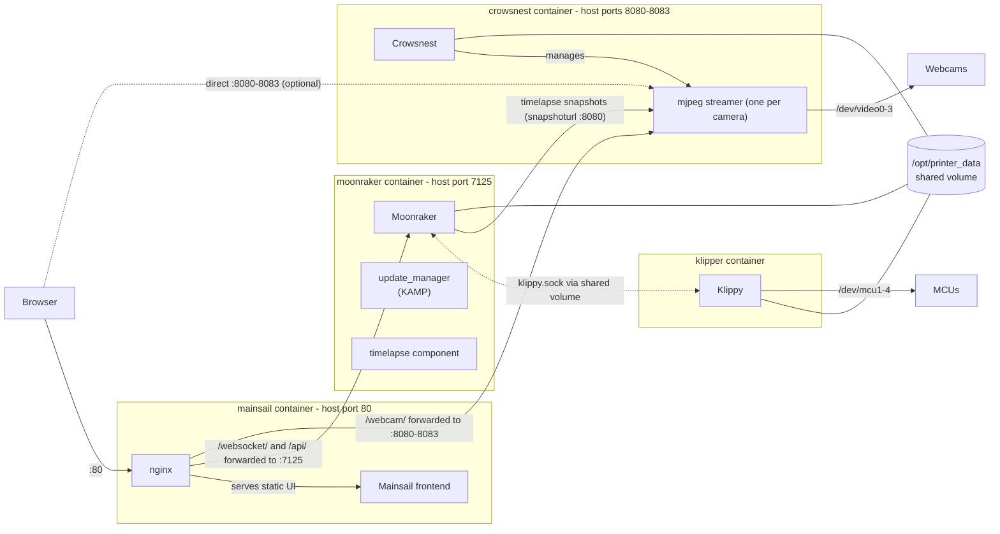

# Klipper-Podman

The complete Klipper 3D-printer stack, Mainsail, Moonraker, Klipper and Crowsnest, running in [Podman](https://podman.io/) containers.

> Created and tested on a Raspberry Pi 4B with Fedora IoT, but it should be compatible with other 64-bit Raspberry Pi models and Fedora CoreOS.

---

## Why not just use MainsailOS or KIAUH?

1. **Stability.** MainsailOS and KIAUH run on a "normal" Debian-based OS, which can break or become unstable after updates. Fedora IoT uses an immutable OSTree system: everything except the important directories is read-only, and each update atomically replaces the whole system. It has a steeper learning curve, but it makes the base OS far more stable and harder to break.
2. **Security.** The Moonraker API has no built-in authentication layer. On MainsailOS or Raspberry Pi OS, a single RCE exploit gives an attacker full access to the host. With Podman, every service runs in an isolated container — still not 100% secure, but it makes doing real damage much harder.

---

## The stack

| Service    | Host port    | Description                                                        |
| ---------- | ------------ | ------------------------------------------------------------------ |
| Mainsail   | `80`         | Web UI (nginx + Mainsail front-end)                                |
| Moonraker  | `7125`       | API / websocket server; also serves the KAMP + timelapse components |
| Klipper    | —            | Printer host software; talks to the MCU(s) via `/dev/mcu1`–`mcu4`   |
| Crowsnest  | `8080`–`8083`| Webcam streaming (one stream per camera, `/dev/video0`–`video3`)    |

All services share the host directory `/opt/printer_data` (mounted at `/root/printer_data` inside the containers), which holds the configs, logs, gcodes and timelapses.



### Repository layout

```
.
├── compose.yaml            # service definitions
├── .env.example            # MCU / camera device path template
├── setup.sh                # one-time setup: printer_data, configs, build
├── start.sh                # start the stack (detached)
├── start-debug.sh          # start the stack in the foreground (live logs)
├── update.sh               # pull repo, prune, rebuild everything
├── config/                 # default configs, copied into printer_data on setup
│   ├── moonraker.conf      # includes KAMP update_manager entry
│   └── crowsnest.conf
├── klipper/                # klipper.Dockerfile
├── moonraker/              # moonraker.Dockerfile
├── mainsail/               # mainsail.Dockerfile + nginx configs
└── crowsnest/              # crowsnest.Dockerfile
```

---

## Installation

### 1. Install Fedora IoT

You need a PC or laptop with Fedora Linux installed (or the Fedora live installer on a USB drive). Other distros will work too, but you're on your own.

Before flashing, set up WiFi (unless using ethernet) and copy your SSH key into the image. The flashing process is covered in detail here:

➡️ [Setting up Fedora IoT on Raspberry Pi and rootless Podman containers](https://fedoramagazine.org/setting-up-fedora-iot-on-raspberry-pi-and-rootless-podman-containers/)

### 2. Set up the OS

SSH into the Pi (passwordless if your keys are in place), then set a root password so you can log in from other devices:

```bash
passwd
```

Install the required packages:

```bash
rpm-ostree install cockpit cockpit-podman git podman-compose
reboot
```

> `cockpit` and `cockpit-podman` are optional but handy for changing firewall rules. After the reboot, enable Cockpit with `systemctl enable --now cockpit.service` (it listens on `0.0.0.0:9090`).

### 3. Clone and build

```bash
git clone https://github.com/Epickitrolaz/Klipper-Podman --depth 1
cd Klipper-Podman
./setup.sh
```

`setup.sh` enables `podman-restart.service`, creates `/opt/printer_data`, copies the default configs into it, clones [KAMP](https://github.com/kyleisah/Klipper-Adaptive-Meshing-Purging) into your config directory, and builds all four containers. Depending on your hardware this takes **~10 minutes on a Pi 5 up to ~2 hours on a Pi Zero 2W**.

### 4. Configure device paths

`setup.sh` creates a `.env` file from `.env.example`. Open it and point the variables at your real hardware:

```bash
vi .env
```

| Variable                       | Mapped to (klipper / crowsnest container) | Find yours with                    |
| ------------------------------ | ----------------------------------------- | ---------------------------------- |
| `MCU_1_DEVICE` … `MCU_4_DEVICE`   | `/dev/mcu1` … `/dev/mcu4`              | `ls -l /dev/serial/by-id/`         |
| `CAMERA_1_DEVICE` … `CAMERA_4_DEVICE` | `/dev/video0` … `/dev/video3`      | `ls -l /dev/v4l/by-id/`            |

- Use the stable **`by-id`** paths, not `/dev/ttyUSB0` or `/dev/video0`.
- Don't have a camera (or spare MCU slots)? Set unused variables to `/dev/null`.

### 5. Start the stack

```bash
./start.sh
```

Once the containers are up, open `http://<your-pi-ip>` in a browser. If the Mainsail page loads, you're done — now configure `printer.cfg`, `moonraker.conf` and other configs (they live in `/opt/printer_data/config` on the host).

> You don't have to edit the config files on the command line — everything in `/opt/printer_data/config` can also be edited directly in the Mainsail UI under the **Machine** tab. The UI reads and writes the exact same files, so both ways always stay in sync.

If the page doesn't load, run the stack in the foreground and watch the logs:

```bash
./start-debug.sh
```

---

## Updating

```bash
./update.sh
```

This removes the containers and build cache, pulls the latest repo, and rebuilds everything. Your printer data in `/opt/printer_data` is not touched.

The update script is also how you update the stack components themselves: Klipper, Moonraker, Mainsail and Crowsnest are pulled into the images at build time, so every image rebuild brings all of them to their latest versions. The only component that updates independently is the KAMP configuration in your config directory, which lives outside the images and is updated through Moonraker's update manager (visible on Mainsail's update page).

---

## Firewall

The stack needs a few ports open to be reachable from other devices. If you enabled Cockpit, go to Networking → Firewall and allow:

| Port         | Protocol | Purpose                                        |
| ------------ | -------- | ---------------------------------------------- |
| `80`         | TCP      | Mainsail web UI (also proxies webcam + API)    |
| `7125`       | TCP      | Moonraker API (for external clients/apps)      |
| `8080`–`8083`| TCP      | Direct access to the camera streams            |

If you decided not to use Cockpit, you'll need to configure the firewall from the terminal instead (Fedora IoT ships with firewalld) — google "firewalld open port" for a current how-to.

---

## Notes

- Containers are started with `restart: always` and `podman-restart.service` is enabled, so the stack comes back by itself after a reboot.
- Since Moonraker has no authentication, **don't expose any ports to the internet**.

## License

[MIT](LICENSE)
